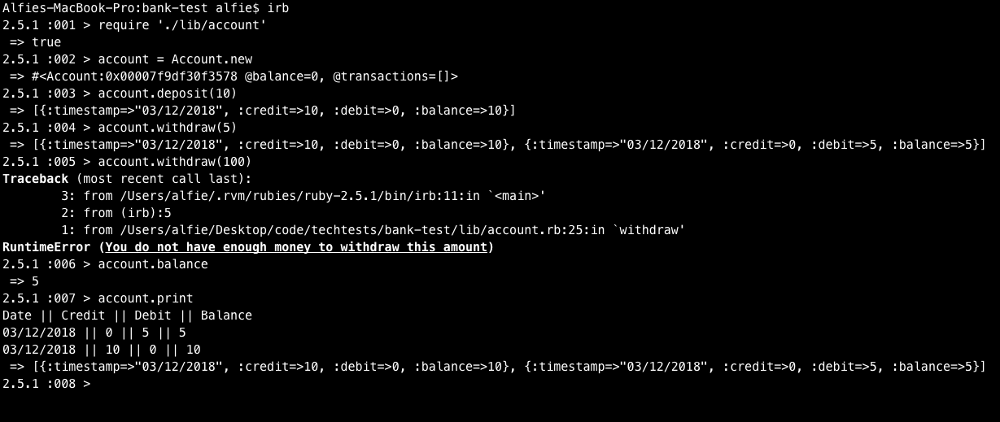

## Bank Tech Test

This is a simple Bank app to be used with irb in the command line.

I have decided to use an Account, Transaction and Printer class setup. The Account class stores User data and calls methods to other classes. The Transaction class returns an instance of itself containing the transaction and is stored in the account class. The Printer class receives transaction history and prints it to the stdout.

The code passes all tests and linting tests and has 100% test coverage.

Clone the repo, run bundle and in your terminal run:

```
bundle
irb
require './lib/account'
```

To run tests in terminal:

```
rspec
rubocop
```

# Tech

I have used Ruby to build the bank. RSpec and Rubocop have been used for testing the requirements and the Timecop gem has been used to test the timestamp functionality. Simplecov has been used to test coverage.

# Features
- accounts: Users can create new accounts
```
account = Account.new
```

- deposits: Users can deposit any amount they like into their bank
```
account.deposit(AMOUNT)
```

- withdrawals: Users can withdraw as much as they like, so long as they have the money in their account (None of this negative balance nonsense)
```
account.withdraw(AMOUNT)
```

- balance checking: Users can easily check their balance
```
account.balance
```

- printing transaction history: Users can see a list of their transaction history, with the most recent tx at the top
```
account.print
```

## Screenshot


